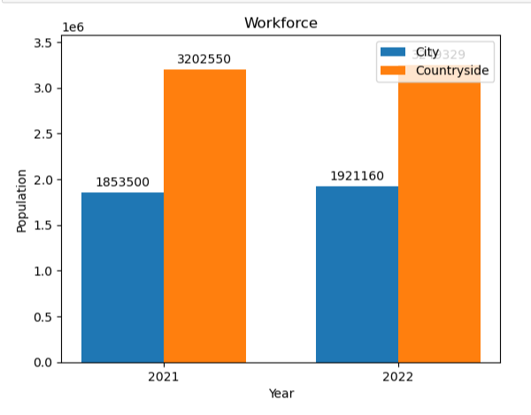
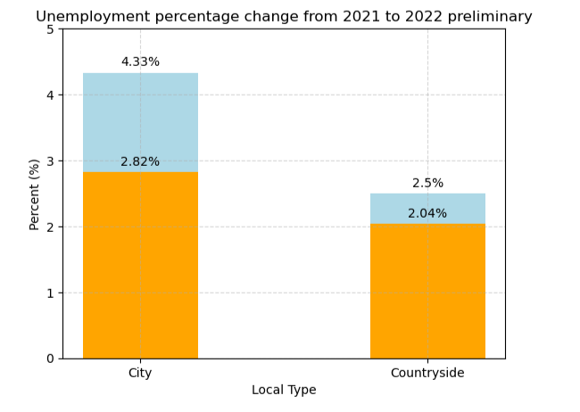
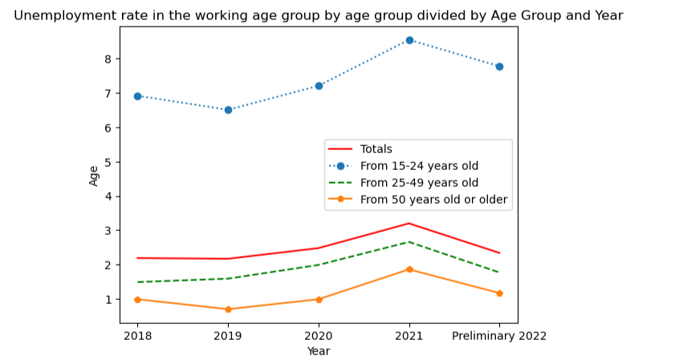
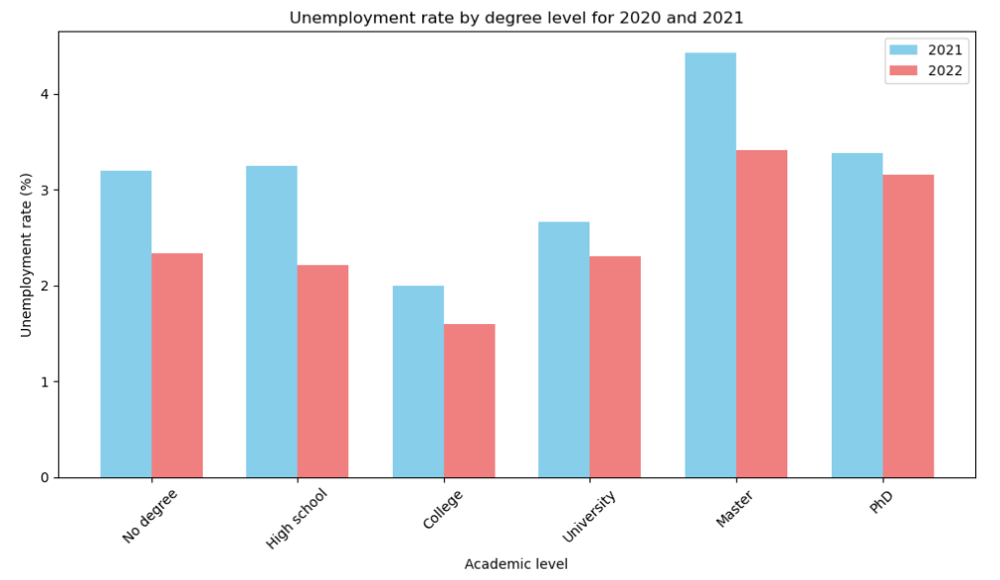
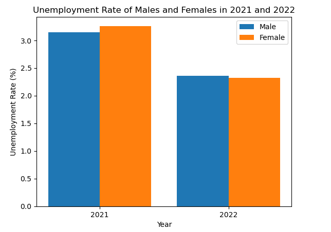

# Data Science Mini-Project

## Content

We would like to summarize the content in today's mini-presentation as follows:

1.   Introduction
2.   Analysis
3.   Recommendation
4.   Appendices

Now, let us begin!

## Introduction

### Group 6

* Dao Duc Manh as the leader
* Nguyen Huu Hoang Phong
* Bui Ngoc Ha
* Nguyen Duc Phuong
* Bui Anh Quan
* Nguyen Manh Quang

### Reason for choosing the topic

Unemployment is a prominent problem that always exists in the economy of each country and globally. Understanding unemployment will help us take corrective measures and reduce the unemployment rate to the lowest level.

## Analysis

### 1. About the workforce in 2021-2022

### 2. Unemployment rate divided by age

### 3. Unemployment rate divided by degree level

### 4. Unemployment rate divided by men and women

## Recommendation

### - Change in the education system:
    
The educational pattern should be completely changed. Students who have a liking for higher studies should be admitted to colleges and universities. Emphasis should be given to vocational education. Qualified engineers should start their own small units.

### - Expansion of Employment exchanges:

More employment exchanges should be opened. Information regarding employment opportunities should be given to people.

### - Population control:

The growth of the population should be checked in order to solve the unemployment, problem. Family planning programmes should be implemented widely and effectively.

## Appendices

All data is taken from the site https://www.gso.gov.vn/
